# API Testing

## Overview

This document records the functional testing performed for the **OpenWeatherMap Current Weather API**.

The API was tested using **Postman** to verify successful requests, query parameters, authentication, and error handling. The OpenAPI specification was also validated using **Swagger Editor**.

---

## Testing Tools

* **Postman** — Used to send API requests and verify API responses.
* **Swagger Editor** — Used to validate the OpenAPI specification.
* **OpenWeatherMap Current Weather API** — API under test.

---

## API Under Test

**Endpoint:**

```text
https://api.openweathermap.org/data/2.5/weather
```

**Method:** `GET`

**Authentication:** API key passed through the `appid` query parameter.

### Request Structure

```text
GET https://api.openweathermap.org/data/2.5/weather?q={{city}}&units={{units}}&appid={{api_key}}
```

The request uses Postman environment variables for the city, units, and API key.

---

# Test Cases

## TC01A — Postman Environment Configuration

### Objective

Verify that the required Postman environment variables are configured correctly.

### Environment Variables

| Variable  | Value              |
| --------- | ------------------ |
| `city`    | London             |
| `units`   | metric             |
| `api_key` | Configured API key |

### Expected Result

The environment variables should be available to the API request.

### Actual Result

The variables were configured successfully and resolved correctly when the request was executed.

### Status

**PASS**

### Evidence

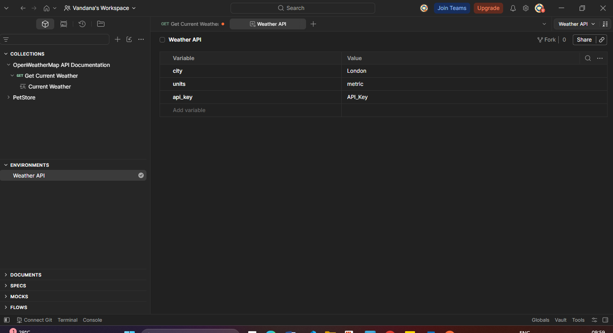

---

## TC01B — Valid City Request

### Objective

Verify that the API returns weather information for a valid city.

### Test Input

```text
city = London
units = metric
```

### Expected Result

The API should return a successful response containing weather information for London.

### Actual Result

The API returned:

```text
200 OK
```

The response included:

```json
"name": "London"
```

### Status

**PASS**

### Evidence

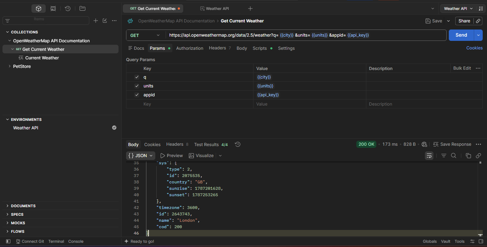
---

## TC02 — Metric Units

### Objective

Verify that the API returns temperature values in Celsius when metric units are specified.

### Test Input

```text
units = metric
```

### Expected Result

The API should return temperature values in Celsius.

### Actual Result

The API returned a successful response with temperature values such as:

```json
"temp": 16.14,
"feels_like": 15.85,
"temp_min": 14.78,
"temp_max": 16.72
```

Because `units=metric` was used, the temperature values are returned in Celsius.

### Status

**PASS**

### Evidence

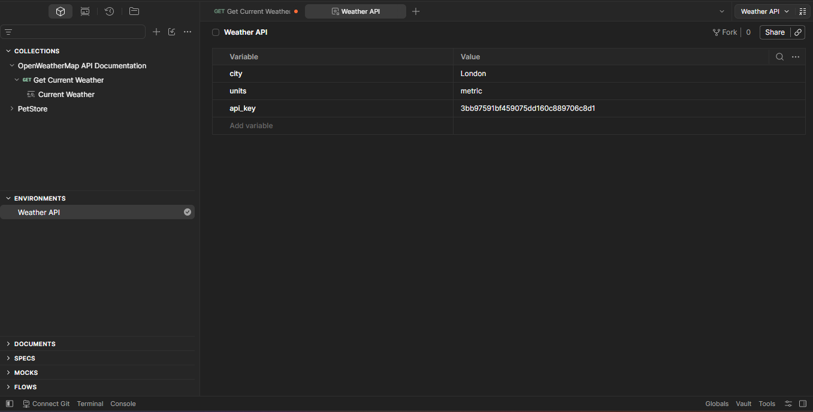

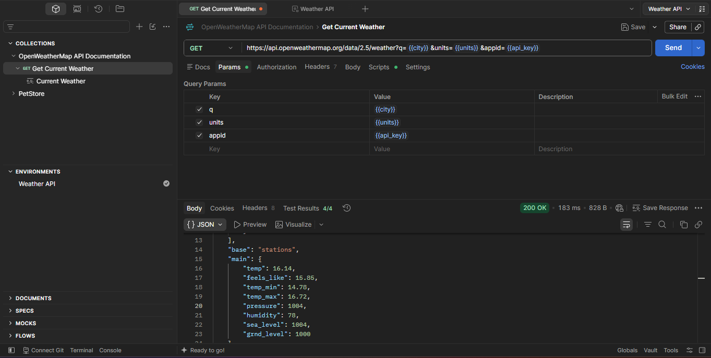
---

## TC03 — City and Country Code

### Objective

Verify that the API correctly processes a city specified with a country code.

### Test Input

```text
city = London,GB
```

### Expected Result

The API should return weather information for London, United Kingdom.

### Actual Result

The API returned:

```text
200 OK
```

The response included:

```json
"name": "London",
"country": "GB"
```

### Status

**PASS**

### Evidence

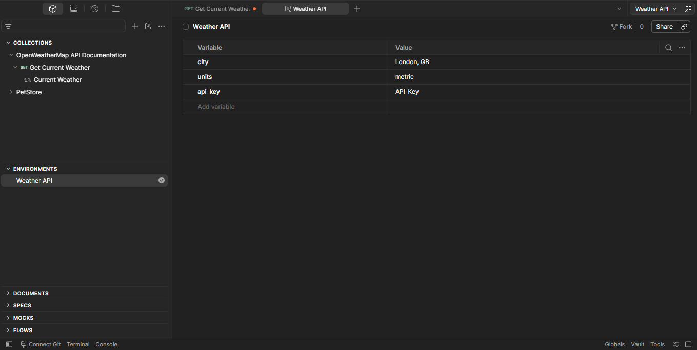

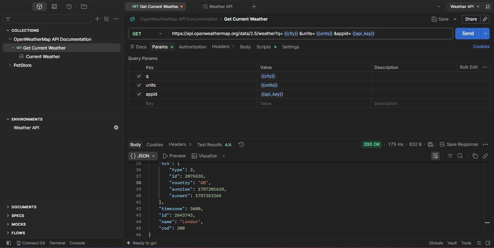

---

## TC04 — Missing Required City Parameter

### Objective

Verify that the API returns an appropriate error when the required `q` parameter is not provided.

### Test Input

The `q` parameter was disabled in Postman.

### Expected Result

The API should reject the request because the city/location parameter is missing.

### Actual Result

The API returned:

```json
{
  "cod": "400",
  "message": "Nothing to geocode"
}
```

### Status

**PASS**

### Evidence

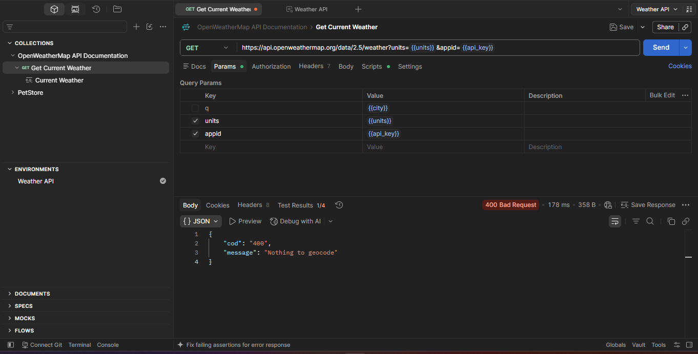

---

## TC05 — Invalid City

### Objective

Verify that the API handles an invalid or nonexistent city name.

### Test Input

```text
city = xyzabc
```

### Expected Result

The API should return an appropriate error indicating that the city could not be found.

### Actual Result

The API returned:

```json
{
  "cod": "404",
  "message": "city not found"
}
```

### Status

**PASS**

### Evidence

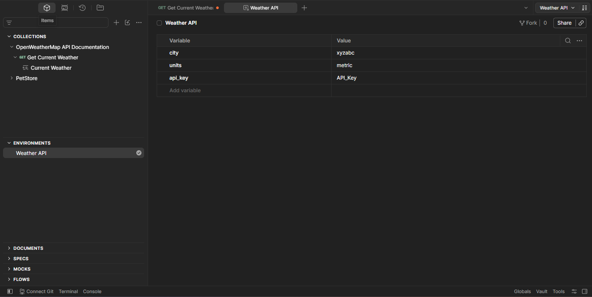

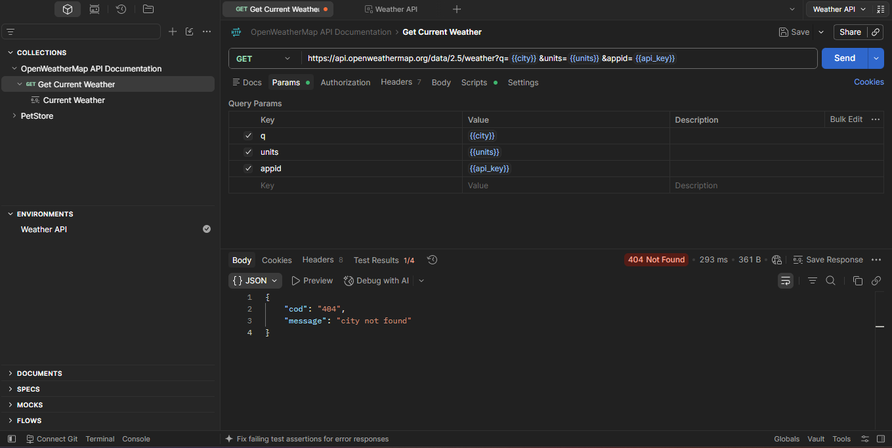

---

## TC06 — Invalid API Key

### Objective

Verify that the API rejects a request containing an invalid API key.

### Test Input

```text
city = London
api_key = Invalid API key
```

### Expected Result

The API should reject the request with an authentication error.

### Actual Result

The API returned:

```json
{
  "cod": 401,
  "message": "Invalid API key."
}
```

### Status

**PASS**

### Evidence

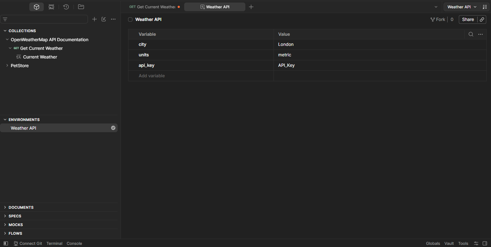

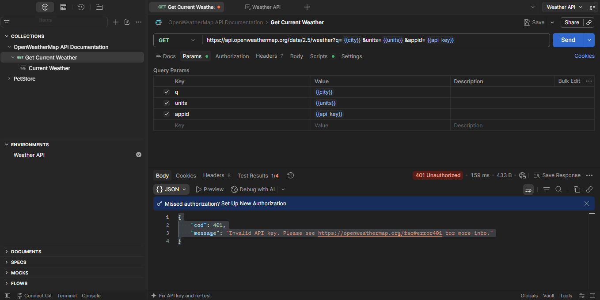

---

## TC07 — Missing API Key

### Objective

Verify that the API rejects a request when the `appid` parameter is not provided.

### Test Input

The `appid` parameter was disabled in Postman.

### Expected Result

The API should reject the request because the API key is missing.

### Actual Result

The API returned:

```json
{
  "cod": 401,
  "message": "Invalid API key."
}
```

### Status

**PASS**

### Evidence

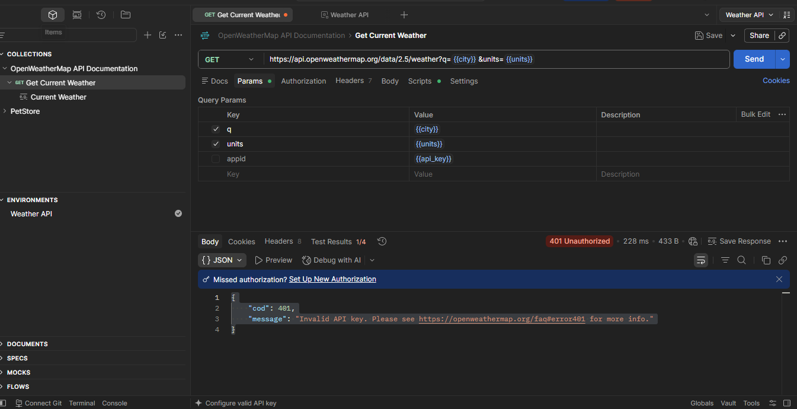

---

# Test Summary

| Test ID | Scenario                  | Expected Result                   | Actual Result                   | Status |
| ------- | ------------------------- | --------------------------------- | ------------------------------- | ------ |
| TC01A   | Environment configuration | Variables configured successfully | Variables resolved successfully | PASS   |
| TC01B   | Valid city                | `200 OK` with weather data        | `200 OK`, London returned       | PASS   |
| TC02    | Metric units              | Temperature in Celsius            | Temperature returned in Celsius | PASS   |
| TC03    | City + country code       | Location identified correctly     | London, GB returned             | PASS   |
| TC04    | Missing `q` parameter     | Client error                      | `400` — Nothing to geocode      | PASS   |
| TC05    | Invalid city              | City-not-found error              | `404` — city not found          | PASS   |
| TC06    | Invalid API key           | Authentication error              | `401` — Invalid API key         | PASS   |
| TC07    | Missing API key           | Authentication error              | `401` — Invalid API key         | PASS   |

---

# OpenAPI Specification Validation

The `openapi.yaml` file was validated using **Swagger Editor**.

### Validation Result

- The OpenAPI specification loaded successfully.
- No validation errors were reported.
- No validation warnings were reported.

The Swagger validation confirms that the OpenAPI specification is structurally valid. Functional API behavior was tested separately using Postman.

---

# Conclusion

The OpenWeatherMap Current Weather API was tested using Postman across positive and negative scenarios.

The tests verified:

* Successful requests for valid cities
* Metric temperature units
* City and country code handling
* Missing required parameters
* Invalid city handling
* Invalid API key handling
* Missing API key handling

All executed test cases passed based on the observed API responses.

The OpenAPI specification was also successfully validated using Swagger Editor without errors or warnings.
